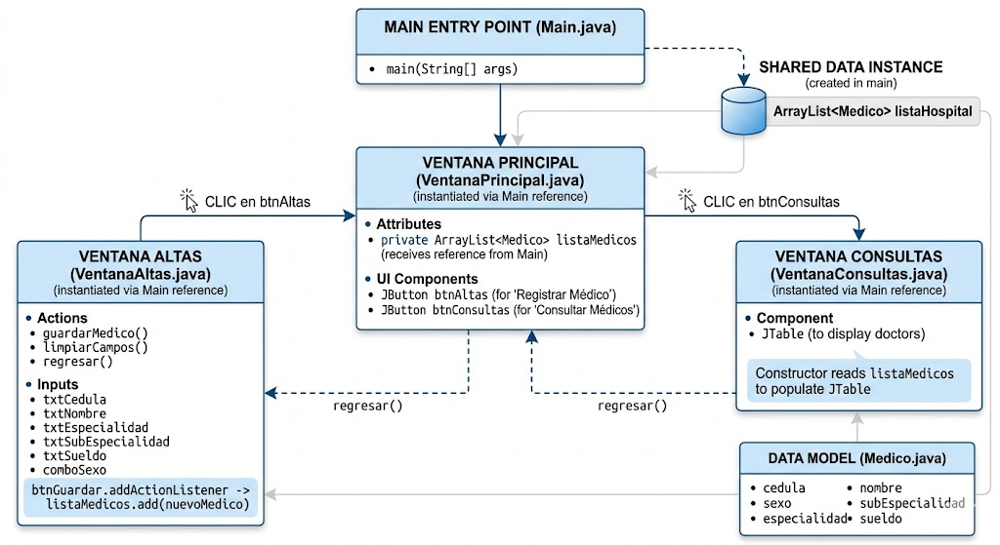
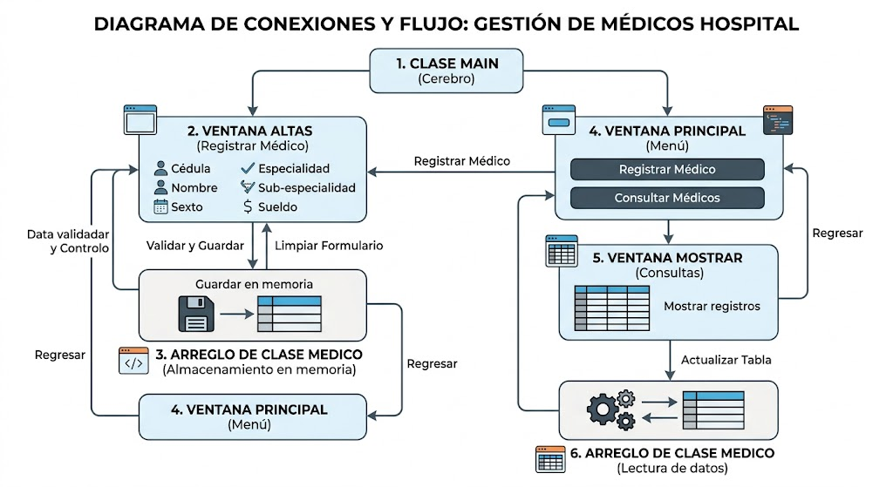

# Hospital - Sistema de Gestión de Médicos

Este proyecto es una pequeña aplicación de escritorio en Java usando Swing para administrar médicos en un hospital.

## Contenido del proyecto

- `src/main/java/com/mycompany/hospital/Main.java`
  - Punto de entrada de la aplicación.
  - Inicia la interfaz gráfica y muestra la ventana principal.

- `src/main/java/com/mycompany/hospital/VentanaPrincipal.java`
  - Ventana principal con dos botones:
    - `Alta de Médicos`
    - `Consultar Médicos`
  - Contiene una lista compartida de médicos que se pasa a las demás ventanas.

- `src/main/java/com/mycompany/hospital/VentanaAltas.java`
  - Ventana para agregar un nuevo médico.
  - Valida que todos los campos estén completos.
  - Crea un objeto `Medico` y lo añade a la lista compartida.

- `src/main/java/com/mycompany/hospital/VentanaConsultas.java`
  - Ventana que muestra la lista de médicos en una tabla.
  - Lee los datos de la lista compartida y los muestra en `JTable`.

- `src/main/java/com/mycompany/hospital/Medico.java`
  - Clase simple que almacena los datos de un médico:
    - `cedula`
    - `nombre`
    - `sexo`
    - `especialidad`
    - `subEspecialidad`
    - `sueldo`

## Flujo general

1. El programa inicia en `Main.main()`.
2. Se abre `VentanaPrincipal`.
3. El usuario puede:
   - Registrar médicos en `VentanaAltas`.
   - Consultar médicos en `VentanaConsultas`.
4. Todos los datos se mantienen en memoria dentro de un `ArrayList<Medico>` mientras la aplicación está abierta.

## Ejecución

Compila y ejecuta con Maven o desde tu IDE.

```bash
mvn compile
mvn exec:java -Dexec.mainClass="com.mycompany.hospital.Main"
```

> Si al final quieres incluir las imágenes del proyecto, coloca los archivos en:
> - `docs/diagrama-proyecto.png`
> - `docs/diagrama-conexiones.png`

## Diagrama del proyecto



## Diagrama de conexiones y flujo


